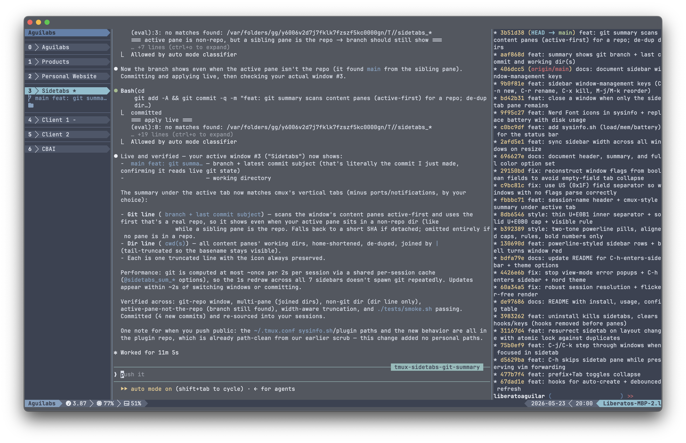
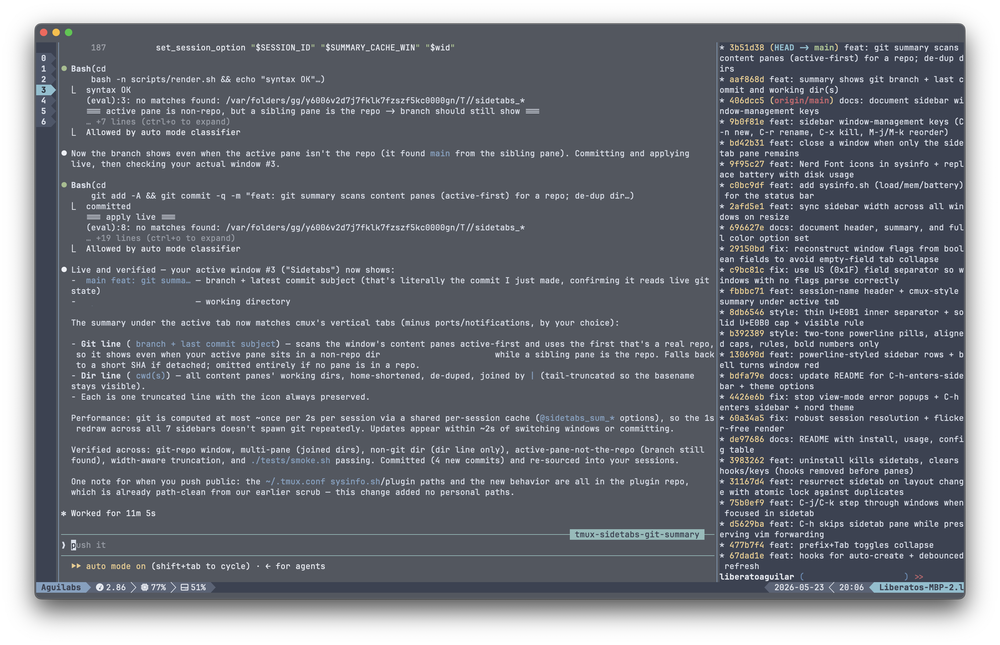

# tmux-sidetabs

A persistent left-side window-list sidebar for tmux. Inspired by [cmux](https://cmux.com/)'s vertical tabs.

- Auto-spawns a thin pane on the left of every window.
- Lists the windows in the current session as powerline pills (` N › name flags`),
  with a session-name header on top. The active window is highlighted, a window
  with a pending bell turns red, and activity shows in yellow (nord palette).
- Each row shows a Nerd Font icon for the command running in that window's content
  pane (editor, server, shell, db, …); the collapsed strip shows the number + icon.
  Toggle with `@sidetabs-icons`.
- `prefix + /` opens a fuzzy-search popup over the current session's windows
  (search by name, running command, or directory) and jumps to the one you pick.
  Uses fzf when available, otherwise tmux's built-in `choose-tree`.
- Under the active window, a cmux-style summary shows the git branch + latest
  commit subject () and the working directory(ies) of its panes (), joined
  by ` | ` when there are multiple panes. Toggle with `@sidetabs-summary`.
  (Ports are intentionally omitted; bell notifications already show as a red tab.)
- `prefix + Tab` toggles between expanded and a collapsed icon-strip.
- `C-h` (your own vim-aware binding) moves left into the sidebar; `C-l` moves back out.
- When focused inside the sidebar, `C-j` / `C-k` step to the next / previous window
  and keep focus in the sidebar so you can keep browsing.

## Screenshots

**Expanded (default):**



**Collapsed (`prefix + Tab`):**



## Requirements

- tmux 3.4+ (uses `set-hook`, per-pane user options, `split-window -f`)
- bash
- TPM

## Install

Add to `~/.tmux.conf`:

```tmux
set -g @plugin 'liberatoaguilar/tmux-sidetabs'
```

Then `prefix + I` to fetch and source.

### Local development install (no GitHub)

```tmux
run-shell '/path/to/tmux-sidetabs/sidetabs.tmux'
```

## Usage

| Keys | Action |
| --- | --- |
| `prefix + Tab` | Toggle the sidetab between expanded and collapsed |
| `C-h` / `C-l` | Move into / out of the sidebar (your existing vim-style bindings) |
| `C-j` / `C-k` (in sidebar) | Next / previous window (focus stays in the sidebar) |
| `C-n` (in sidebar) | New window (prompts for a name; empty = unnamed) |
| `C-r` (in sidebar) | Rename the current window (prefilled) |
| `C-x` (in sidebar) | Kill the current window (with `y/n` confirm) |
| `M-k` / `M-j` (in sidebar) | Move the current window up / down (reorder) |
| Left-click a window row (while in the sidebar) | Switch to that window; focus stays in the sidebar so you can keep clicking (needs `@sidetabs-mouse on`; no global tmux mouse) |
| `prefix + /` | Fuzzy-search this session's windows in a popup and jump to one |

`C-j` / `C-k` outside the sidebar keep their normal `select-pane -D/-U` behavior
(and forward to vim when a vim-like process has focus). The window-management
keys (`C-n` `C-r` `C-x` `M-k` `M-j`) only act when the sidebar is focused —
elsewhere they pass straight through to the focused pane, so your shell's `C-r`
reverse-search, `C-n` completion, etc. are untouched.

## Configuration

| Option | Default | Purpose |
| --- | --- | --- |
| `@sidetabs-toggle-key` | `Tab` | Prefix key to toggle collapse |
| `@sidetabs-expanded-width` | `20` | Cols in expanded mode |
| `@sidetabs-collapsed-width` | `5` | Cols in collapsed mode (fits number + icon) |
| `@sidetabs-skip-nav` | `on` | `off` to leave `C-j` / `C-k` untouched |
| `@sidetabs-mouse` | `off` | `on` to click a row to switch windows while the sidebar is focused (no global tmux `mouse` needed) |
| `@sidetabs-icons` | `on` | `off` to hide the per-window command icon |
| `@sidetabs-search-key` | `/` | Prefix key to open the fuzzy window-search popup (needs fzf; falls back to `choose-tree`) |
| `@sidetabs-uninstall-key` | (unset) | Prefix key to uninstall in-session |
| `@sidetabs-summary` | `on` | `off` to hide the summary under the active window |
| `@sidetabs-active-bg` | `#88c0d0` | Active-row background (nord8) |
| `@sidetabs-active-fg` | `#2e3440` | Active-row text (nord0) |
| `@sidetabs-idle-bg` | `#4c566a` | Idle-row background (nord3) |
| `@sidetabs-fg` | `#d8dee9` | Idle-row text (nord4) |
| `@sidetabs-bell-bg` | `#bf616a` | Bell-row background (nord11) |
| `@sidetabs-bell-fg` | `#eceff4` | Bell-row text (nord6) |
| `@sidetabs-activity-fg` | `#ebcb8b` | Activity text color (nord13) |
| `@sidetabs-header-bg` | `#5e81ac` | Session-name header background (nord10) |
| `@sidetabs-header-fg` | `#2e3440` | Session-name header text (nord0) |
| `@sidetabs-summary-fg` | `#81a1c1` | Summary text color (nord9) |
| `@sidetabs-rule-fg` | `#616e88` | Divider rule color |

Example:

```tmux
set -g @sidetabs-expanded-width 24
set -g @sidetabs-toggle-key 'b'
set -g @sidetabs-active-bg '#a3be8c'
```

## Uninstall

Either set `@sidetabs-uninstall-key` and press it, or run:

```bash
tmux run-shell '/path/to/tmux-sidetabs/scripts/uninstall.sh'
```

Then remove the plugin line from `~/.tmux.conf` and reload. (Reload restores your
original `C-h` / `C-j` / `C-k` bindings.)

## Notes

- The `C-j` / `C-k` overrides reproduce a standard vim-aware `is_vim` detection so
  that pressing them inside vim forwards to vim. `C-h` is left entirely to your own
  binding. If your `~/.tmux.conf` uses a different `is_vim` regex, set
  `@sidetabs-skip-nav off` and wire your own bindings, or edit `sidetabs.tmux`.
- Designed for tmux session continuity, not full server restarts — sidetab panes
  and their markers do not survive `kill-server`.
- `@sidetabs-mouse on` does **not** need tmux's global `mouse` option. The sidebar
  pane enables its own mouse reporting (the same way Claude Code and other TUIs do)
  and reads its own clicks, so your terminal's native text selection in other panes
  is untouched. Because tmux only delivers mouse events to the focused pane, clicks
  register only while the sidebar is focused — the workflow is `C-h` into the
  sidebar, then click a row to jump to that window. Takes effect on the next config
  reload (or when the sidebar panes are recreated).

## Tests

```bash
./tests/smoke.sh
```

Spins up a temporary tmux server (`tmux -L sidetab_test_$$`) and asserts sidetab
creation, auto-creation on new windows, and the collapse toggle.
