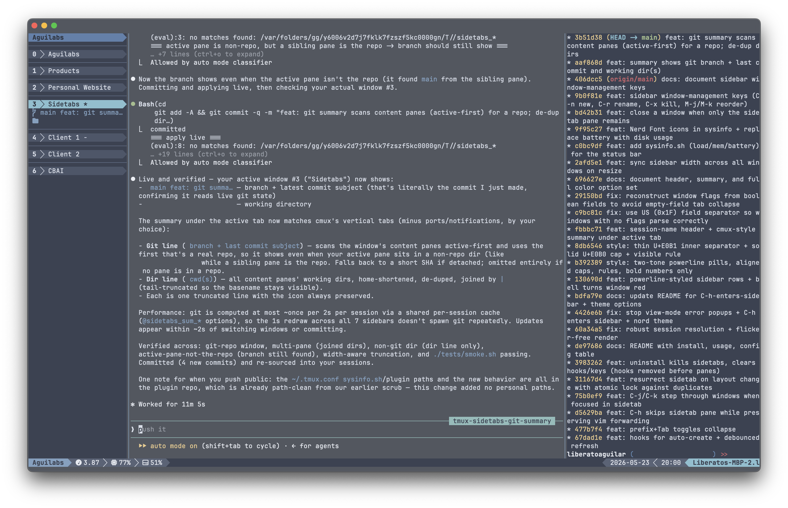
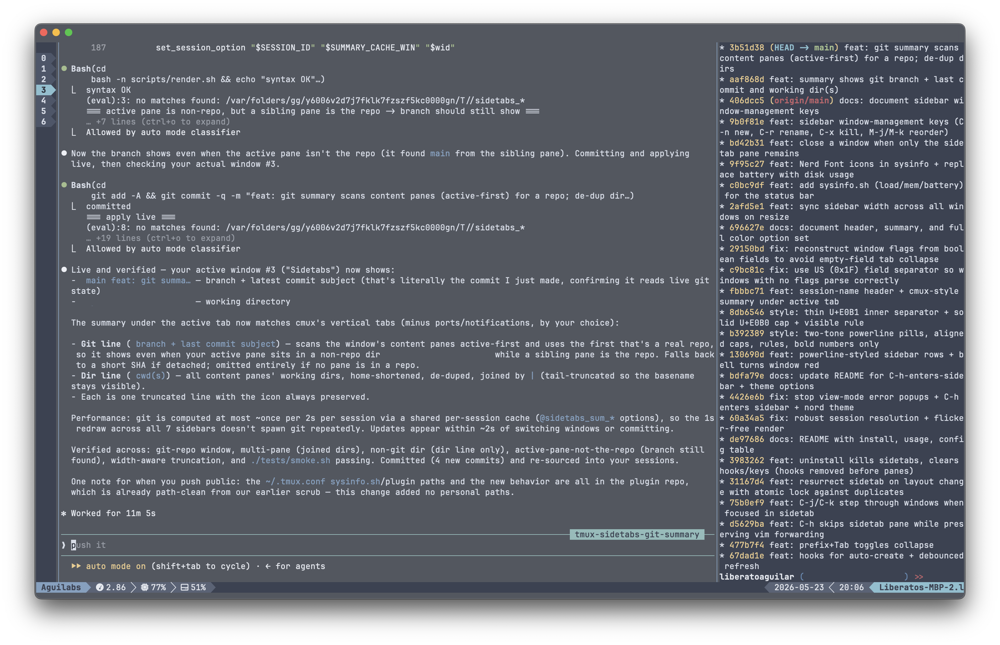

# tmux-sidetabs

A persistent left-side window-list sidebar for tmux. Inspired by [cmux](https://cmux.com/)'s vertical tabs.

- Auto-spawns a thin pane on the left of every window.
- Lists the windows in the current session as powerline pills (` N › name flags`),
  with a session-name header on top. The active window is highlighted, a window
  with a pending bell turns red, and activity shows in yellow (nord palette).
- Each row shows a Nerd Font icon for the command running in that window's content
  pane (editor, server, shell, db, AI coding agents, …); the collapsed strip shows
  the number + icon. Toggle with `@sidetabs-icons`.
- `prefix + /` opens a fuzzy-search popup over the current session's windows
  (search by name, running command, or directory) and jumps to the one you pick.
  Uses fzf when available, otherwise tmux's built-in `choose-tree`.
- Under the active window, a cmux-style summary shows the git branch + latest
  commit subject () and the working directory(ies) of its panes (), joined
  by ` | ` when there are multiple panes. Toggle with `@sidetabs-summary`.
  (Ports are intentionally omitted; bell notifications already show as a red tab.)
- `prefix + Tab` toggles between expanded and a collapsed icon-strip.
- Opt in with `@sidetabs-session-strip on` and the bottom bar becomes one pill per
  **session**, colored by bells, agent attention and the color you gave it, and
  shrinking in a fixed order rather than being clipped (see
  [Session strip](#session-strip)).
- `C-h` (your own vim-aware binding) moves left into the sidebar; `C-l` moves back out.
- When focused inside the sidebar, `C-j` / `C-k` step to the next / previous window
  and keep focus in the sidebar so you can keep browsing.

## Screenshots

**Expanded (default):**



**Collapsed (`prefix + Tab`):**



## Requirements

- tmux 3.4+ (uses `set-hook`, per-pane user options, `split-window -f`)
- bash
- TPM

## Install

Add to `~/.tmux.conf`:

```tmux
set -g @plugin 'liberatoaguilar/tmux-sidetabs'
```

Then `prefix + I` to fetch and source.

### Local development install (no GitHub)

```tmux
run-shell '/path/to/tmux-sidetabs/sidetabs.tmux'
```

## Usage

| Keys | Action |
| --- | --- |
| `prefix + Tab` | Toggle the sidetab between expanded and collapsed |
| `C-h` / `C-l` | Move into / out of the sidebar (your existing vim-style bindings) |
| `C-j` / `C-k` (in sidebar) | Next / previous window (focus stays in the sidebar) |
| `C-n` (in sidebar) | New window (prompts for a name; empty = unnamed) |
| `C-r` (in sidebar) | Rename the current window (prefilled) |
| `C-x` (in sidebar) | Kill the current window (with `y/n` confirm) |
| `M-k` / `M-j` (in sidebar) | Move the current window up / down (reorder) |
| Left-click a window row (while in the sidebar) | Switch to that window; focus stays in the sidebar so you can keep clicking (needs `@sidetabs-mouse on`; no global tmux mouse) |
| `prefix + /` | Fuzzy-search this session's windows in a popup and jump to one |
| `C-c` (in sidebar) | Cycle the current window's flag color one step forward (yellow → green → blue → purple → orange → teal → indigo → slate → none) |
| `M-c` (in sidebar) | Open the flag color **picker**: a menu of live color swatches — press `1`-`8` to jump straight to a color, `0` to clear |
| `M-s` (in sidebar) | Open the **session** color picker (same palette). The color tints the sidebar header pill in every window of that session; `0` clears it |
| `C-t` (in sidebar) | Start / pause / resume the current window's stopwatch; counting pauses when the window loses focus (hourglass glyph ⏳ = auto-held, counting resumes on focus) |
| `M-t` (in sidebar) | Open the timer menu: adjust total time, cancel current interval, reset the timer, assign a client, or (once tagged, with a tags file configured) register the current repo |
| `M-n` (in sidebar) | Edit the current window's **note** in a popup (`$EDITOR`); multi-line text is kept, save an empty buffer to clear it. Windows with a note show a sticky-note glyph  |

`C-j` / `C-k` outside the sidebar keep their normal `select-pane -D/-U` behavior
(and forward to vim when a vim-like process has focus). The window-management
keys (`C-n` `C-r` `C-x` `M-k` `M-j`) only act when the sidebar is focused —
elsewhere they pass straight through to the focused pane, so your shell's `C-r`
reverse-search, `C-n` completion, etc. are untouched.

## Configuration

| Option | Default | Purpose |
| --- | --- | --- |
| `@sidetabs-toggle-key` | `Tab` | Prefix key to toggle collapse |
| `@sidetabs-expanded-width` | `20` | Cols in expanded mode |
| `@sidetabs-collapsed-width` | `5` | Cols in collapsed mode (fits number + icon) |
| `@sidetabs-skip-nav` | `on` | `off` to leave `C-j` / `C-k` untouched |
| `@sidetabs-mouse` | `off` | `on` to click a row to switch windows while the sidebar is focused (no global tmux `mouse` needed) |
| `@sidetabs-icons` | `on` | `off` to hide the per-window command icon |
| `@sidetabs-search-key` | `/` | Prefix key to open the fuzzy window-search popup (needs fzf; falls back to `choose-tree`) |
| `@sidetabs-uninstall-key` | (unset) | Prefix key to uninstall in-session |
| `@sidetabs-summary` | `on` | `off` to hide the summary under the active window |
| `@sidetabs-active-bg` | `#88c0d0` | Active-row background (nord8) |
| `@sidetabs-active-fg` | `#2e3440` | Active-row text (nord0) |
| `@sidetabs-idle-bg` | `#4c566a` | Idle-row background (nord3) |
| `@sidetabs-fg` | `#d8dee9` | Idle-row text (nord4) |
| `@sidetabs-bell-bg` | `#bf616a` | Bell-row background (nord11) |
| `@sidetabs-bell-fg` | `#eceff4` | Bell-row text (nord6) |
| `@sidetabs-activity-fg` | `#ebcb8b` | Activity text color (nord13) |
| `@sidetabs-header-bg` | `#5e81ac` | Session-name header background (nord10) |
| `@sidetabs-header-fg` | `#2e3440` | Session-name header text (nord0) |
| `@sidetabs-summary-fg` | `#81a1c1` | Summary text color (nord9) |
| `@sidetabs-rule-fg` | `#616e88` | Divider rule color |
| `@sidetabs-flag-colors` | `#ebcb8b #a3be8c #81a1c1 #b48ead #d08770 #8fbcbb #9d7cd8 #8b95a8` | Space-separated hex colors offered by `C-c` / `M-c` (yellow, green, blue, purple, orange, teal, indigo, slate). Add or remove entries freely — the picker and the cycle both size themselves to the list. No red: the bell state owns red |
| `@sidetabs-flag-names` | `yellow green blue purple orange teal indigo slate` | Picker labels, positional against `@sidetabs-flag-colors`. A shorter list is fine — unnamed slots show their hex instead |
| `@sidetabs-flag-fg` | `#2e3440` | Flag pill text color (nord0) |
| `@sidetabs-flag-key` | `C-c` | Key to cycle the current window's flag color (set to `none` to disable — applies to every key option) |
| `@sidetabs-flag-picker-key` | `M-c` | Key to open the flag color picker menu (`none` to disable) |
| `@sidetabs-session-flag-key` | `M-s` | Key to open the **session** color picker (`none` to disable). Sessions share `@sidetabs-flag-colors`; there is no cycle key, since a session color is set once rather than flipped daily |
| `@sidetabs-flag-store` | `~/.local/share/tmux-sidetabs/flags.tsv` | Path to the durable flag-color store (TSV: session, window name, palette index — an **empty** window name is that session's own color). Rewritten as a whole-state snapshot on every color change, so clears persist and rows for sessions/windows that are closed are kept for their return |
| `@sidetabs-flag-restore` | `on` | `off` to disable re-seeding window flag colors **and** session colors from the store — both after a tmux-resurrect restore and via the boot-time `client-attached` fallback |
| `@sidetabs-session-strip` | `off` | `on` turns the bottom bar into the **session strip** — one pill per session in `status-left` (see [Session strip](#session-strip)). Off by default: this is a sidebar plugin, and it must not eat your status bar unasked |
| `@sidetabs-strip-left-N` | (unset) | Left edge pill `N`, scanned `1`..`16` and stopping at the first gap. The value is tmux **format** syntax — typically `#(some command)`, but `#{...}` and strftime `%`-specs work too. Quote it with **single** quotes in your config: tmux expands `#{...}` and `$VARs` inside double quotes |
| `@sidetabs-strip-left-N-bg` / `-fg` | idle colors | Per-pill colors for left pill `N`; default to `@sidetabs-strip-idle-bg` / `-fg`, so an uncolored pill blends into the strip |
| `@sidetabs-strip-right-N` | (unset) | Right edge pill `N`, same rules. **Setting `-1` hands `status-right` to the plugin**; leaving it unset keeps that side yours (see the strip section's note on disowning it) |
| `@sidetabs-strip-right-N-bg` / `-fg` | idle colors | Per-pill colors for right pill `N` |
| `@sidetabs-strip-current-bg` | `blue` | Background of the current session's pill. There is deliberately no `-fg` twin — the text is always `black` |
| `@sidetabs-strip-idle-bg` | `brightblack` | Background of a session pill with nothing to say |
| `@sidetabs-strip-idle-fg` | `white` | Text of an idle session pill |
| `@sidetabs-strip-bell-bg` | `#bf616a` | Background of a session holding a bell or an agent `attention` (nord11) |
| `@sidetabs-strip-bell-fg` | `#eceff4` | Text of a bell / attention pill (nord6) |
| `@sidetabs-strip-bg` | `black` | The bar's own background — what the last pill's arrow points into |
| `@sidetabs-strip-sep-fg` | `match` | Ink for the thin separator drawn where two neighboring pills share a background. `match` is a sentinel meaning *derived from that pill* — its own background carried 40% of the way toward its own foreground — so a grey pill gets a muted grey separator and a cyan pill a deeper cyan one, each a shade of the pill it sits on. Any other value is a literal color used at every such join. Color boundaries are unaffected — their arrow is always the left pill's background |
| `@sidetabs-strip-sep-glyph` | `U+E0B1` | Glyph for a same-background join, the thin powerline chevron. The solid `U+E0B0` arrow drawn at a real color boundary is fixed and has no option |
| `@sidetabs-strip-current-marker` | `▎` | Marker drawn on the current session's pill — only when that session carries a color of its own, and always at the narrowest cascade stage |
| `@sidetabs-strip-name-max` | `0` | Hard cap on a session name in the strip, applied before the width cascade starts (`0` = no cap). For short names at *every* width, not only a narrow one |
| `@sidetabs-strip-assumed-width` | `200` | Width budget for a session with **no** attached client. Its strip is still generated — otherwise attaching would show a stale one — but there is no client to ask how wide it is |
| `@sidetabs-strip-reserve` | `auto` | Columns to reserve for a `status-right` the plugin does not own. `auto` measures what it can and allows 12 columns per unmeasurable `#(shell)` job; a plain number replaces the estimate outright |
| `@sidetabs-timer-key` | `C-t` | Key to start / pause the current window's timer |
| `@sidetabs-timer-menu-key` | `M-t` | Key to open the timer menu (adjust total, cancel current interval, reset, assign client, register repo) |
| `@sidetabs-timer-autofocus` | `on` | `off` to disable auto pause/resume when window loses/gains focus |
| `@sidetabs-timer-restore` | `on` | `off` to disable re-seeding timers from the event log — both after a tmux-resurrect restore and via the boot-time `client-attached` fallback |
| `@sidetabs-note-key` | `M-n` | Key to open the note editor popup for the current window (`none` to disable) |
| `@sidetabs-note-icon` | (sticky note) | Glyph shown on rows that have a note. Any string works — set it to something ASCII if your font lacks Nerd Font glyphs. A multi-character icon is measured and takes its columns from the window name, so a long one leaves less room for the name |
| `@sidetabs-note-store` | `~/.local/share/tmux-sidetabs/notes.tsv` | Path to the durable note index (TSV: session, window name, note id — one row per noted window). Note **text** lives one file per note in `<store>.d/`, so notes have no length limit |
| `@sidetabs-agent-status` | `on` | `off` stops any new agent signal being raised **and** hides any that is already showing (see [Agent status](#agent-status)) — the agent-side hooks can stay installed, they just stop costing anything. Flipping it off mid-turn is safe: a row that was lit at the time goes quiet immediately, and visiting the tab still clears the stored state |
| `@sidetabs-agent-done-fg` | `#a3be8c` | Color of the ✓ glyph on a finished agent's row (nord14) |
| `@sidetabs-timer-log` | `~/.local/share/tmux-sidetabs/timelog.tsv` | Path to the timer event log (TSV v3: timestamp, event type, interval start, interval duration, total, session, window, window_id, cwd, tag; events are `start` / `resume` / `pause` / `auto-pause` / `auto-resume` / `adjust` / `cancel` / `reset` / `restore`. `tag` is the window's `@sidetabs_timer_tag` at write time, or `-` when untagged; readers also accept older 9-col (v2, no tag) and legacy 6-col rows) |
| `@sidetabs-timer-tags-file` | `~/.local/share/tmux-sidetabs/tags.tsv` | Path to the tags file (TSV: tag, label, reset_day; `#` comments). Written by `aguilabs usage configure --sync`; read only by this plugin for menu labels, per-tag cycle-reset days, and the "assign client…" / "register repo…" menu items below |

Example:

```tmux
set -g @sidetabs-expanded-width 24
set -g @sidetabs-toggle-key 'b'
set -g @sidetabs-active-bg '#a3be8c'
```

## Session strip

The sidebar shows the **windows** of the session you are in. The session strip is
the other half: the bottom bar becomes one powerline pill per session, in stable
creation order, colored by what is actually happening in each one.

```tmux
set -g @sidetabs-session-strip on
```

It is **off by default** — this is a sidebar plugin, and taking over your status
bar without being asked would be hostile. While off, nothing is written: the
script returns before touching a single tmux option.

| Pill looks like | Meaning |
| --- | --- |
| **red** (`@sidetabs-strip-bell-bg`) | some window in that session has a pending bell, or an agent in it is asking for you (`attention`) |
| **its own color** | you gave the session a color with `M-s` |
| **blue** (`@sidetabs-strip-current-bg`) | the session you are in |
| **grey** (`@sidetabs-strip-idle-bg`) | everything else |

First match wins, top to bottom — the same precedence the sidebar's window rows
use, so a session pill and a window row never disagree about what matters most.
A `▎` marker appears on the current session's pill **only when that session
carries a color of its own**: an uncolored current session is already identified
by its blue, and a colored one has given that slot away.

Separators follow the classic powerline rule, and which glyph a join gets depends
on whether there is a color boundary there at all.

Two pills with **different** backgrounds have a real boundary between them, so
the separator is the solid arrow (U+E0B0) with `fg` = the left pill's background
and `bg` = the right pill's — it reads as the left pill's own edge cutting into
the next one. That is the `>` look, and it is deliberately not configurable.

Two adjacent pills that **share** a background have no boundary to draw, so the
separator is a thin chevron (U+E0B1, `@sidetabs-strip-sep-glyph`) on the shared
background instead. A solid arrow there would either vanish into the surface
under it or, forced into a contrasting ink, read as a heavy dark wedge between
two pills that are in fact the same color.

The chevron's ink is `@sidetabs-strip-sep-fg`, whose default is the sentinel
`match`, meaning **derived from the pill it sits on**: that pill's own
background, blended 40% of the way toward its own foreground, channel by
channel. A white-on-grey session pill gets a muted grey chevron; a
black-on-cyan sysinfo pill gets a deeper cyan one. The ink is therefore
different for every differently-colored pill in the same strip — visible enough
to read as a divider, close enough to the pill to belong to it, rather than one
foreign color laid over all of them. Named colors (`brightblack`, `cyan`, …)
are resolved to their nord hex first; a background with no hex to resolve to (a
`colour123` index, an unknown name) falls back to the pill's foreground. Set
the option to a color to override the derivation everywhere.

Both glyphs are one display column wide, so a join costs the width cascade
exactly one column whichever of the two it draws.

### Edge pills

Anything else you want pinned to either side — load, memory, disk, a clock —
goes in numbered options, each its own individually colored pill:

```tmux
set -g @sidetabs-strip-left-1 '#(/path/to/tmux-sidetabs/scripts/sysinfo.sh load)'
set -g @sidetabs-strip-left-1-bg cyan
set -g @sidetabs-strip-left-1-fg black
set -g @sidetabs-strip-left-2 '#(/path/to/tmux-sidetabs/scripts/sysinfo.sh mem)'
set -g @sidetabs-strip-left-2-bg cyan
set -g @sidetabs-strip-left-2-fg black
set -g @sidetabs-strip-left-3 '#(/path/to/tmux-sidetabs/scripts/sysinfo.sh disk)'
set -g @sidetabs-strip-left-3-bg cyan
set -g @sidetabs-strip-left-3-fg black
```

Numbered options rather than one delimited list, because a pill's value is tmux
format syntax on purpose: a `#(foo | bar)` simply cannot break the parse when
there is no delimiter for it to be confused with. They are scanned `1`..`16` and
stop at the first gap, so `-1` `-2` `-4` gives you two pills. **Use single
quotes**: tmux expands `#{...}` and `$VARs` inside double quotes, and a pill's
value has to reach the option verbatim so tmux can expand it at render time.

`scripts/sysinfo.sh` takes an optional `load` | `mem` | `disk` argument for
exactly this (a bare call still prints all three, unchanged), so the three
measurements can be three pills the cascade drops one at a time instead of one
opaque blob that goes all at once.

**These options must be set before the `run-shell` that loads the plugin** —
`sidetabs.tmux` draws the strip once at load and reads the master switch first.

### The width cascade

tmux truncates a status line by **hard cut** at the client edge: no ellipsis, no
marker, and a 2-column glyph that does not fit is dropped whole. A clipped strip
is therefore indistinguishable from a short one — you cannot tell that three
sessions fell off the right-hand edge. So the strip does not clip; it sheds
detail, in a fixed and predictable order, until it fits:

| Stage | What goes |
| --- | --- |
| 0 | nothing — marker, full names, every edge pill |
| 1 | the `▎` marker |
| 2 | right edge pills, outermost first, one per stage |
| 3 | left edge pills, outermost first, one per stage |
| 4 | session names truncated to 12, then 8, then 6, then 4 |
| 5 | ordinary sessions shrink to a single initial |
| 6 | ordinary sessions become a bare block of their color |
| 7 | floor: `▎<the session you are in> +N` |

"Ordinary" means a session with no color of its own and no bell or agent
attention. Stages 5 and 6 never touch a colored or alerting pill — the pills
carrying information you deliberately set are the last to degrade, and the pill
for the session you are in is never shortened at all. The floor is truthful at
any width and always names where you are.

The budget is the width of the **narrowest client attached to that session**,
minus whatever is reserved for a `status-right` the plugin does not own.

The plugin also sets tmux's own length caps per session, and **neither is set to
the budget** — both are deliberately tighter:

- **`status-left-length`** is set to `budget − reserve − the plugin's own right
  chain`, i.e. exactly the columns the cascade just fitted the left side into.
  It can never clip content the cascade decided to keep (it is never smaller than
  the string), and being no larger makes tmux's own cap a **hard backstop**: if
  one of *your* `#(shell)` edge pills renders wider than the 12 columns guessed
  for it, tmux cuts our pill rather than letting it run over your clock. tmux's
  default here is `10`, which would cut the strip off after the first pill, so
  something has to be set — this is the tightest correct value.
- **`status-right-length`** is set to the measured width of the plugin's own
  right chain, not to the budget, for the same reason. It is written **only when
  the plugin owns that side** (`@sidetabs-strip-right-1` set); a side you own is
  never given a length any more than it is given content.

### Handing over `status-right`

The plugin always owns `status-left`. It owns `status-right` **only when
`@sidetabs-strip-right-1` is set**. Leave that unset and the plugin never writes
that side — not even to clear it — so your own clock, or another plugin's
content, is left alone. It is *measured* and **reserved** instead, so the strip
fits itself around it rather than running underneath it.

One consequence is worth knowing before it surprises you: **unsetting the last
`@sidetabs-strip-right-N` does not put your old `status-right` back.** The plugin
stops owning the side, and from that moment on it starts *reserving* the string
it last wrote there — because a disowned side is never cleared, only measured.
Set `status-right` back to what you want yourself after taking it back.

### tmux facts this is built on

Measured on tmux 3.6b. Several of these are load-bearing, and one contradicts the
documentation — please read before "simplifying" anything here.

- **`#{session_bell_flag}` is broken and always returns `0`.** Upstream's
  `format_cb_session_bell_flag` has an `RB_FOREACH` whose body `return`s
  unconditionally on the first iteration, so only the session's *lowest-index
  window* is ever examined. `#{session_activity_flag}` and
  `#{session_silence_flag}` are worse: they test the format target's winlink
  rather than the loop variable, so they merely mirror the per-window flag.
  **Do not reach for any of the three.** Per-window `#{window_bell_flag}` is
  correct, and `scripts/strip.sh` rolls it up per session in bash. This is not a
  candidate for simplification — it is the workaround for the bug.
- **`status-left` and `status-right` are per-session options.** `set-option -t A
  status-left AAA` and `-t B ... BBB` hold independently. That is what makes one
  generated string per session possible, and it is why "is this pill the current
  session" is known statically at generation time — no `#{?#{==:...}}` ternary
  survives into the output.
- **The argv path caps at ~16KB** ("command too long", counted in bytes — the same
  ceiling that once capped notes), while `printf … | tmux source-file /dev/stdin`
  has no such limit. The whole batch of `set-option`s is delivered that way, in
  one process: a tmux invocation costs ~5ms, a command inside one costs ~nothing.
- **Truncation is a hard cut by display column** — no ellipsis, no marker, and a
  2-column glyph that does not fit is dropped whole. Style escapes do not count
  toward the length. This is the entire reason the width cascade exists.
- **Uppercase hex corrupts under a second format expansion** (`#D` is the
  `pane_id` alias, `#S` the session name, and so on), so every color the strip
  emits is lowercased first. `#d08770` survives; `#D08770` does not.
- The strip is **generated, not templated**. A `#{S:}` loop cannot see its own
  neighbors, and a powerline arrow needs *both* the colors it sits between. The
  version this replaced worked around that with per-session `@strip_next`
  bookkeeping refreshed by hooks — bookkeeping that only ever existed in a
  *running* server, so it was stale after every restart and the separators came
  back the wrong color. A generator knows every neighbor directly, so there is
  nothing left to go stale.

### Known limitations

- **Width is counted in characters**, so a CJK session name misaligns the strip
  (exactly as a CJK window name misaligns the sidebar today).
- **Cascade stages flap on a slow resize.** Regeneration is triggered by
  `client-resized`, so dragging a terminal across a stage boundary pops a pill in
  and out. There is no hysteresis; accepted.
- **Stale store rows are never pruned**, so a new session that reuses an old
  session's name inherits that name's color.
- **Two clients on one session share the narrowest budget.** One string is
  generated per session, so fitting the wider client would silently clip the
  narrower one.
- **A config reload alone does not restore `status-left`.** It is a per-session
  option and the plugin sets it per session, so a *global* `set -g status-left …`
  is shadowed by the per-session value. `scripts/uninstall.sh` therefore unsets
  it per session for you (see [Uninstall](#uninstall)) — but if you remove the
  plugin without running that script, the strip stays on screen until you unset
  it yourself.

## Agent status

Coding agents (Claude Code, codex, opencode) run inside a pane. Point their tool
hooks at `scripts/agent_status.sh` and the sidebar tells you, at a glance, which
tabs are busy, which are waiting on you, and which are done:

| Sidebar shows | State | Meaning |
| --- | --- | --- |
| spinner + elapsed on the row (`⠹ 4m`) | `working` | the agent is off doing something |
| the whole row goes **bell-red** | `attention` | the agent is blocked on you (permission prompt, question) |
| a green ✓ on the row | `done` | the agent finished its turn |

Nothing is installed for you — wiring is deliberately on your side, in the
agent's own config. Replace `<plugin>` with the absolute path to your clone.

### Claude Code

In `~/.claude/settings.json`:

```json
{
  "hooks": {
    "UserPromptSubmit": [
      { "hooks": [{ "type": "command", "command": "<plugin>/scripts/agent_status.sh working" }] }
    ],
    "Notification": [
      { "hooks": [{ "type": "command", "command": "<plugin>/scripts/agent_status.sh attention" }] }
    ],
    "Stop": [
      { "hooks": [{ "type": "command", "command": "<plugin>/scripts/agent_status.sh done" }] }
    ],
    "SessionEnd": [
      { "hooks": [{ "type": "command", "command": "<plugin>/scripts/agent_status.sh clear" }] }
    ]
  }
}
```

`matcher` is omitted throughout: none of these four events is tool-scoped.
`PreToolUse` is **deliberately not wired** — it fires on every single tool call,
so it would spend a process per tool to re-assert a state that `UserPromptSubmit`
already set. `UserPromptSubmit` is what makes `working` possible at all: it is
the only signal that says "a turn just started".

### codex

In `~/.codex/config.toml`:

```toml
notify = ["<plugin>/scripts/agent_status.sh", "codex-notify"]
```

codex appends its JSON payload as the last argument; the `codex-notify` mode
parses it without a `jq` dependency (bash's own regex over the `"type"` field).
It maps `agent-turn-complete` → `done` and any approval/permission/confirm-shaped
type → `attention`; **anything it does not recognize is a silent no-op**, because
a wrong signal is worse than no signal. codex has no "turn started" notification,
so codex tabs generally show `done` and `attention` but never the `working`
spinner.

Extra arguments of your own in that array are fine — they are ignored, never
mistaken for a target. The pane is taken from `$TMUX_PANE`; pass
`"--pane", "%3"` only if you need to override it.

### opencode

No adapter code is needed — a plugin/event hook that execs the same CLI works.
Map session-idle to `done` and any permission/ask event to `attention`:

```bash
<plugin>/scripts/agent_status.sh done
<plugin>/scripts/agent_status.sh attention
```

### Semantics worth knowing

- **The pane is the unit of truth, the window is what you see.** Each pane keeps
  its own state; the row shows the *worst* state in the window
  (`attention` > `working` > `done`). Two agents in one window, one asking for
  permission and one grinding, shows red.
- **Visiting a tab consumes the signal**, exactly like a bell: switching to a
  window — or just moving to another of its panes — clears `done` and `attention`
  for all of them. `working` survives a visit: it is a fact about the world, not
  a notification. That holds even when a permission prompt interrupted it, which
  is the common case — answering the prompt puts the tab back to `working`, on
  its original clock, for the rest of the turn.
- **A signal raised on the tab you are already looking at never lights up**,
  again like a bell, which tmux never raises on the current window: you were
  there when it happened, so `done` and `attention` are consumed the instant
  they arrive. (Only with a client attached — nobody attached means nobody
  looking.) `working` still shows, since it is not a notification.
- **Elapsed time doesn't restart on re-assertion.** Re-asserting the same state
  keeps the original clock (and skips the redraw entirely), so an agent that
  fires `working` on every prompt costs nothing and the row's elapsed keeps
  answering "how long has it been like this".
- **A signal cannot outlive its pane.** If the pane holding it goes away — you
  kill it, the agent crashes, the shell exits — the row is re-derived from the
  panes that are still there. An agent that dies without its `SessionEnd`/`Stop`
  hook firing cannot leave a tab spinning forever.
- **Collapsed mode shows attention only.** The red pill is a color, so it
  survives; there is no room for the spinner or the ✓.
- The whole feature switches off with `set -g @sidetabs-agent-status off` —
  including anything already on screen when you flip it.
- Invoked outside tmux, the script exits 0 in silence — safe in a shared
  `settings.json` that follows you onto machines without tmux.

## Uninstall

Either set `@sidetabs-uninstall-key` and press it, or run:

```bash
tmux run-shell '/path/to/tmux-sidetabs/scripts/uninstall.sh'
```

Then remove the plugin line from `~/.tmux.conf` and reload. (Reload restores your
original `C-h` / `C-j` / `C-k` bindings.)

If you had the [session strip](#session-strip) on, the script puts the status
line back for you. `status-left` is a **per-session** option and the plugin sets
it per session, so a per-session value shadows any global one your config sets —
a reload on its own would write a global that the leftover value hides. So
`uninstall.sh` unsets `status-left` and `status-left-length` on every session,
and your own (or tmux's default) status line shows through again immediately.

`status-right` is unset only on the sessions where the plugin actually owned it,
i.e. only if you had set `@sidetabs-strip-right-1`. A `status-right` the plugin
never wrote is never cleared — the same rule that keeps it from writing over your
clock while installed.

## Notes

- The `C-j` / `C-k` overrides reproduce a standard vim-aware `is_vim` detection so
  that pressing them inside vim forwards to vim. `C-h` is left entirely to your own
  binding. If your `~/.tmux.conf` uses a different `is_vim` regex, set
  `@sidetabs-skip-nav off` and wire your own bindings, or edit `sidetabs.tmux`.
- Designed for tmux session continuity, not full server restarts — sidetab panes
  and their markers do not survive `kill-server`.
- `@sidetabs-mouse on` does **not** need tmux's global `mouse` option. The sidebar
  pane enables its own mouse reporting (the same way Claude Code and other TUIs do)
  and reads its own clicks, so your terminal's native text selection in other panes
  is untouched. Because tmux only delivers mouse events to the focused pane, clicks
  register only while the sidebar is focused — the workflow is `C-h` into the
  sidebar, then click a row to jump to that window. Takes effect on the next config
  reload (or when the sidebar panes are recreated).
- **Flag colors**: `C-c` steps forward through the palette (fast when you just want
  *some* color); `M-c` opens a picker menu showing each color as a real swatch, with
  the current one marked, so you can jump straight to one with a number key. Both act
  on the same per-window state, so they're interchangeable.
- **Session colors**: `M-s` opens the same picker for the **session** rather than the
  window. The color it sets tints the sidebar's header pill — the session-name bar at
  the top — in *every* window of that session, so a glance at any sidebar tells you
  which session you're in. `0` clears it and the header goes back to
  `@sidetabs-header-bg`. There is no cycle key: a session color is set once, unlike a
  window flag you flip through the day.
- The palette is an ordered list and both the window option and the session option
  store an **index** into it, so reordering `@sidetabs-flag-colors` recolors existing
  window flags and session colors alike. Append new colors at the end to avoid that.
  Sessions deliberately share the window palette — there is one list to configure.
- Bell notifications (red row) always outrank flag colors — a window with a pending
  bell displays in red regardless of its flag.
- **Timer behavior**: When a timer is running in a focused window, it counts only while
  that window is active (selected). Switching to another window auto-pauses the timer
  (shown with the hourglass glyph ⏳); returning to that window auto-resumes it (disable
  with `@sidetabs-timer-autofocus off`). Manually pausing with `C-t` is sticky — the
  timer will not auto-resume on focus; press `C-t` again to manually resume. Detaching
  from tmux (closing your terminal) does **not** auto-pause the timer — use the adjust
  menu (`M-t` → "adjust total…") to correct a forgotten timer. Adjust accepts: `+15m`,
  `-90`, `1:30:00` (hours:minutes:seconds), `10:00` (minutes:seconds), or a bare number
  for seconds; the total is clamped at 0.
- **Timers survive restarts** (with tmux-resurrect/continuum): live state is
  session-only, but the post-restore hook replays the timer log — the durable
  record — and re-seeds each window's total, tag and cycle marker, matching
  windows by session + window *name* (ids change across restarts; renamed
  windows don't match, and with duplicate names only the lowest-indexed window
  is seeded). A timer that was running comes back auto-held and resumes when its
  window regains focus; a manual pause comes back paused; a reset timer stays
  gone. The tag comes from the log's `tag` column (rows written before v3 come
  back untagged); `@sidetabs_timer_last_reset` is not a logged column, so it is
  derived — the date of that window's last `reset` row, else of its first row —
  which is what makes a billing boundary crossed while the server was down still
  reset on the next interaction. Each re-seed logs a `restore` event. Seconds
  between the last logged event and the server dying are not recoverable.
  Disable with `@sidetabs-timer-restore off`.
- **Flag colors survive restarts too.** Every set and every clear — from `C-c`,
  from the `M-c` picker, from the `M-s` session picker, and from a window rename
  — writes the whole live flag state through to `@sidetabs-flag-store`, and the
  post-restore hook replays it onto the new server, matched by session + window
  *name* for a window flag and by session *name* for a session color (ids change
  across restarts; with duplicate window names only the first window wins). A
  window or session that already carries a color is never overwritten, a record
  naming something that no longer exists is ignored rather than misapplied, and
  a record whose index no longer fits `@sidetabs-flag-colors` is dropped.
  Disable with `@sidetabs-flag-restore off`.

  The store is a **snapshot**, not a ledger: each write rewrites it from live
  state, so a flag you cleared is genuinely gone, while rows for sessions and
  windows that are not currently open are kept untouched — close a session and
  its colors are waiting when you open it again. Nothing is ever pruned, so a
  new session reusing an old name inherits that name's colors. The new store is
  written to a temp file and moved into place only once every step succeeded,
  so an unreadable store or a full disk leaves it exactly as it was rather than
  emptying it.
- **Restore has a second delivery path.** tmux-continuum skips auto-restore
  entirely when another tmux server was running at startup, or when the server
  is older than `@continuum-restore-max-delay` — resurrect's post-restore hook
  then never fires and every timer silently stays at zero. A `client-attached`
  hook covers that case, but only while the server is younger than two minutes
  and only once per server generation (`@sidetabs_timer_restored`): re-seeding
  on a later attach could hand a freshly created window the total of a long-gone
  window with the same name. A restore that fails now says so with a
  `display-message` instead of being swallowed. Flag colors use the same
  fallback on the next `client-attached` slot, with their own generation flag
  (`@sidetabs_flag_restored`) so disabling one restore cannot make the other
  think the generation is already seeded.
- **Per-tag billing-cycle reset**: a window carrying a tag (`@sidetabs_timer_tag`)
  whose row in the tags file names a reset day (1–31, clamped to the month's real
  length) zeroes itself on that day each month. The check is lazy — it happens on
  the next timer interaction or focus tick after the boundary, so a machine asleep
  across the date catches up on its own — and it logs an ordinary `reset` event,
  which is a boundary marker in the log, never a subtraction. A running timer keeps
  running (logged `reset` + `resume`), and the interval that was open when the
  boundary was noticed is closed into the outgoing cycle first. The first time a
  tagged window is seen the current cycle start is only recorded
  (`@sidetabs_timer_last_reset`), so enabling this mid-cycle never zeroes a live
  total. Untagged windows, and tags with reset day `0`, never auto-reset.
- **Assign client / register repo** (`M-t` → the two bottom entries): "assign
  client…" opens a submenu built from `@sidetabs-timer-tags-file` — one entry
  per row (label, marked "(current)" for the window's assigned tag), plus an
  "untagged (clear)" entry — and picking one sets or clears
  `@sidetabs_timer_tag`. tmux has no native nested menu, so this submenu is a
  second `display-menu` opened by the first menu's item. "register repo for
  `<label>`…" only appears once the window is tagged **and** the tags file
  exists (it stays hidden for non-aguilabs users); picking it shells out in
  the background to `aguilabs usage configure --customer <customer> --add-repo
  <cwd>`, where `<customer>` is the tag up to its first `:` (a
  `customer:project` tag registers under the customer) and `<cwd>` is the
  active *content* pane's directory (never the sidetab strip's). Missing
  `aguilabs` on `PATH`, or no resolvable content-pane cwd, reports via
  `display-message` and is otherwise a no-op.
- Killing a window with a running timer silently drops the unlogged in-flight interval —
  if timing a long task, pause first to ensure it's logged.
- Timers use wall-clock time: laptop sleep counts toward elapsed time. The timer
  continues even when the sidebar is collapsed.
- **Notes**: `M-n` (sidebar focused) opens the current window's note in a popup
  running your `$EDITOR`. **Notes have no length limit**, and multi-line text,
  indentation and tabs are all preserved — reopening the popup gives you the note
  back exactly as you wrote it. Only control characters, trailing whitespace and
  blank lines at the very start and end are stripped. Saving an empty buffer
  clears the note.

  The text lives in a file of its own (`<store>.d/<note-id>`); the window option
  and the TSV store hold only that id. That indirection is what lifts the limit —
  tmux rejects any command over ~16KB (`command too long`, counted in *bytes*, so
  a CJK note hits it three times sooner), which capped a note kept inline in the
  option no matter how the cap was tuned. The row shows the note's **presence**
  only — a sticky-note glyph after the window flags, never the text — and only in
  expanded mode (the collapsed strip has no room for it), so note text never
  reaches a render format.

  Notes survive restarts on their own: every edit writes through to
  `@sidetabs-note-store`, and the post-restore hook re-seeds live windows from
  it, matched by session + window *name* (so renaming a window detaches its
  stored note until you next edit it, and with duplicate names only the
  lowest-indexed window is seeded). A window that already has a note is never
  overwritten by a restore.

  Notes written before this store existed were kept inline in the window option;
  they still open normally and convert to a file the first time you save them.
  `scripts/note.sh gc` deletes note files that no store row and no live window
  references — nothing runs it automatically, since an orphan costs a few KB and
  deleting a wanted note does not.

## tmux-resurrect integration

Add all three hooks to `.tmux.conf` (paths to your clone):

```tmux
set-option -g @resurrect-hook-pre-restore-all  'bash <plugin>/scripts/resurrect_pre.sh'
set-option -g @resurrect-hook-post-restore-all 'bash <plugin>/scripts/resurrect_post.sh'
set-option -g @resurrect-hook-post-save-all    'bash <plugin>/scripts/resurrect_scrub.sh'
```

pre/post suppress duplicate sidebars during a restore, adopt the restored strips
in place, move focus off the sidebar into a content pane, and restore timers and
notes.
The post-save scrub rewrites the sidebar strip lines inside the resurrect save
file (cwd -> the window's first content pane's cwd; active flag -> that pane):
without it, tmux-resurrect builds every window with `new-window -c <first
pane's cwd>` — and the strip is always pane 0 — so every restored window's
base shell would open in the sidebar's directory, focused on the strip.

## Tests

```bash
./tests/smoke.sh
```

Spins up a temporary tmux server (`tmux -L sidetab_test_$$`) and asserts sidetab
creation, auto-creation on new windows, and the collapse toggle.

The other suites cover one feature area each and run the same way — a throwaway
server on its own socket, always with `-f /dev/null` so your `~/.tmux.conf`
cannot leak in:

```bash
./tests/features_smoke.sh        # flag colors + focus-aware timers
./tests/visibility_smoke.sh      # the render loop's visibility gate
./tests/resurrect_smoke.sh       # tmux-resurrect pre/post hooks
./tests/resurrect_scrub_smoke.sh # post-save rewrite of the save file
./tests/timer_restore_smoke.sh   # re-seeding timers from the event log
./tests/flag_restore_smoke.sh    # durable window flag + session colors, and their restore
./tests/session_flag_smoke.sh    # the M-s session color picker and the header tint
./tests/strip_smoke.sh           # the session strip: pills, precedence, edge pills, width cascade
./tests/uninstall_hooks_smoke.sh # uninstall tears down only our own hook indices (drift check)
./tests/move_window_smoke.sh     # moving a window between sessions re-pins its sidebar
./tests/notes_smoke.sh           # per-window notes + durable store
./tests/agent_status_smoke.sh    # agent status: aggregation, visit-clear, render
./tests/tag_menu_smoke.sh        # assign-client submenu + register-repo passthrough
./tests/timer_cycle_smoke.sh     # per-tag billing-cycle auto reset
./tests/resurrect_complex_e2e.sh # multi-pane layouts across a real resurrect save/restore
```
